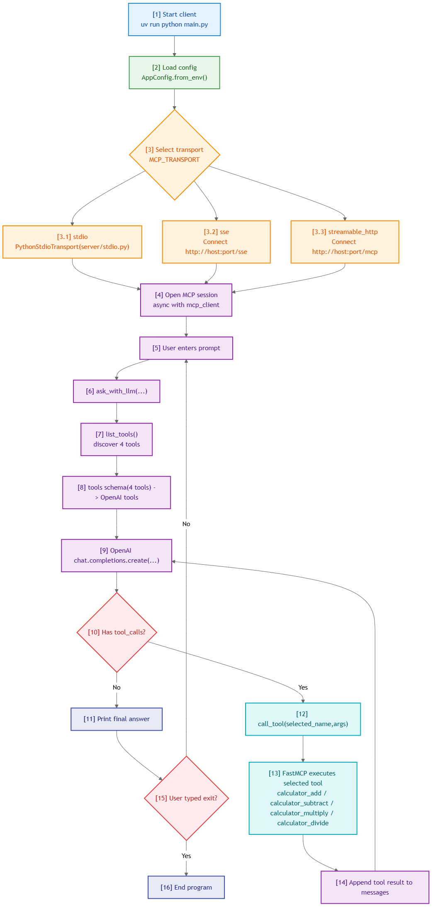

# MCP Minimal Interactive Demo

EN | [zh-CN](./README_zh-CN.md)

Start the program and chat directly in terminal.

Current structure (client/server split):

```text
mcp-tutorial/
|-- main.py                  # Program entry (interactive client)
|-- config.py                # Config schema and .env loading
|-- client/
|   |-- runtime.py           # MCP client transport routing (stdio/sse/streamable_http)
|   `-- llm.py               # OpenAI init + tool-calling loop
`-- server/
    |-- app.py               # MCP server and tool definitions
    |-- runtime.py           # MCP server transport routing
    |-- stdio.py             # stdio server entry
    |-- sse.py               # sse server entry
    `-- streamable_http.py   # streamable_http server entry
```

## 1. Install

```bash
uv sync
```

## 2. Configure `.env`

```env
OPENAI_API_KEY=your_api_key
OPENAI_BASE_URL=https://dashscope.aliyuncs.com/compatible-mode/v1
OPENAI_MODEL=qwen-plus

MCP_TRANSPORT=stdio
MCP_HOST=127.0.0.1
MCP_PORT=8000
MCP_SSE_PATH=/sse
MCP_STREAMABLE_PATH=/mcp
LLM_MAX_TOOL_ROUNDS=3
```

## 3. Run

### 3.1 stdio (simplest)

```bash
uv run python main.py
```

Then type directly:

```text
You: help me calculate 1+2
Assistant: 1 + 2 = 3
```

Type `exit` to quit.

### 3.2 sse (two terminals)

Update `.env` first:

```env
MCP_TRANSPORT=sse
MCP_HOST=127.0.0.1
MCP_PORT=8000
MCP_SSE_PATH=/sse
```

Terminal A (server):

```bash
uv run python -m server.sse
```

Terminal B (client):

```bash
uv run python main.py
```

Type `exit` in terminal B to quit client, and `Ctrl+C` in terminal A to stop server.

### 3.3 streamable_http (two terminals)

Update `.env` first:

```env
MCP_TRANSPORT=streamable_http
MCP_HOST=127.0.0.1
MCP_PORT=8000
MCP_STREAMABLE_PATH=/mcp
```

Terminal A (server):

```bash
uv run python -m server.streamable_http
```

Terminal B (client):

```bash
uv run python main.py
```

Type `exit` in terminal B to quit client, and `Ctrl+C` in terminal A to stop server.

## 4. MCP Basics for Beginners

### 4.1 What is MCP?

MCP (Model Context Protocol) is a standard way for models to connect to external tools.

Without MCP, each tool integration often needs custom glue code.  
With MCP, both sides follow the same protocol, so integration becomes consistent.

In one line: MCP is a standard interface for models to discover and use tools/resources/prompts.

### 4.2 Three transport options in this demo

1. `stdio`  
Communication through standard input/output, usually local subprocess mode.

2. `sse`  
HTTP + Server-Sent Events. Good for long-running remote server mode.

3. `streamable_http`  
HTTP-based MCP endpoint, suitable for web-style deployment.

The protocol is still MCP in all cases.  
Only the transport changes.

### 4.3 MCP vs Function Calling

1. Function Calling  
A model API feature where the model decides which function to call.

2. MCP  
A protocol layer that standardizes model-to-tool communication across environments.

In this project, LLM decides tool calls, then actual tool execution happens via MCP client/server.

### 4.4 What is JSON-RPC 2.0 in MCP?

MCP messages are structured with JSON-RPC style request/response:

```json
{
  "jsonrpc": "2.0",
  "id": 1,
  "method": "tools/call",
  "params": {
    "name": "calculator_add",
    "arguments": {"a": 1, "b": 2}
  }
}
```

### 4.5 Core MCP workflow in this demo

1. User enters a request in `main.py`.
2. Client calls `tools/list` to discover MCP tools.
3. Client sends tool schemas to LLM.
4. LLM returns `tool_calls`.
5. Client executes selected tool via `tools/call`.
6. Tool result is fed back to LLM.
7. LLM generates the final natural-language answer.

Workflow diagram:



## Extra docs

- [MCP complete call flow (EN)](./docs/mcp_complete_call_flow.md)
