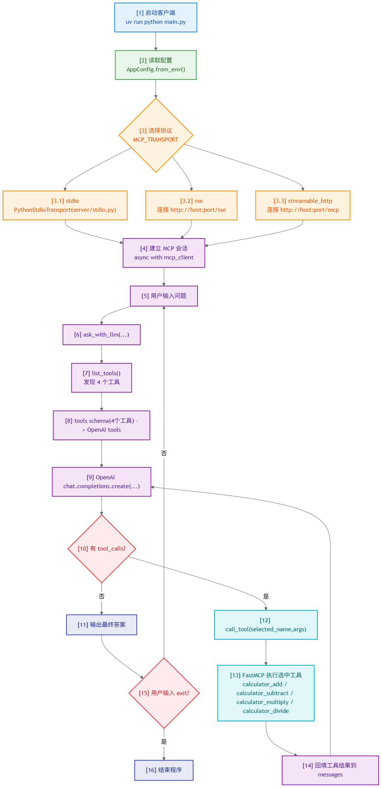

# MCP 最小交互 Demo

[English](./README.md) | [中文](./README_zh-CN.md)

只需要启动程序，然后直接输入问题。

当前结构（已拆分客户端/服务端）：

```text
mcp-tutorial/
|-- main.py                  # 程序入口（客户端对话）
|-- config.py                # 配置 schema 与 .env 读取
|-- client/
|   |-- runtime.py           # stdio/sse/streamable_http 客户端连接分发
|   `-- llm.py               # OpenAI 初始化 + tool-calling
`-- server/
    |-- app.py               # MCP server 与工具定义
    |-- runtime.py           # stdio/sse/streamable_http 服务端启动分发
    |-- stdio.py             # stdio 服务端入口
    |-- sse.py               # sse 服务端入口
    `-- streamable_http.py   # streamable_http 服务端入口
```

## 1. 安装

```bash
uv sync
```

## 2. 配置 `.env`

```env
OPENAI_API_KEY=你的百炼APIKey
OPENAI_BASE_URL=https://dashscope.aliyuncs.com/compatible-mode/v1
OPENAI_MODEL=qwen-plus

MCP_TRANSPORT=stdio
MCP_HOST=127.0.0.1
MCP_PORT=8000
MCP_SSE_PATH=/sse
MCP_STREAMABLE_PATH=/mcp
LLM_MAX_TOOL_ROUNDS=3
```

## 3. 启动

### 3.1 stdio（最简单）

```bash
uv run python main.py
```

启动后直接输入：

```text
你：帮我计算一下1+2等于几
助手：1 + 2 = 3
```

输入 `exit` 可结束程序。

### 3.2 sse（双终端）

先改 `.env`：

```env
MCP_TRANSPORT=sse
MCP_HOST=127.0.0.1
MCP_PORT=8000
MCP_SSE_PATH=/sse
```

终端 A（服务端）：

```bash
uv run python -m server.sse
```

终端 B（客户端）：

```bash
uv run python main.py
```

终端 B 输入问题，输入 `exit` 退出客户端；终端 A 用 `Ctrl+C` 停止服务端。

### 3.3 streamable_http（双终端）

先改 `.env`：

```env
MCP_TRANSPORT=streamable_http
MCP_HOST=127.0.0.1
MCP_PORT=8000
MCP_STREAMABLE_PATH=/mcp
```

终端 A（服务端）：

```bash
uv run python -m server.streamable_http
```

终端 B（客户端）：

```bash
uv run python main.py
```

终端 B 输入问题，输入 `exit` 退出客户端；终端 A 用 `Ctrl+C` 停止服务端。

## 4. MCP 零基础教学

### 4.1 MCP 是什么

MCP（Model Context Protocol）可以理解成：  
给大模型和外部工具之间，定义了一套“统一插座标准”。

以前你接不同工具，常常要写不同的适配代码；  
有了 MCP 后，模型端和工具端只要都遵循这个协议，就能按统一方式通信。

一句话总结：  
MCP = 让模型更标准地“看见并调用”外部能力（工具、资源、提示模板）的协议。

### 4.2 MCP 三种传输协议分别是什么

在这个 demo 里用到三种传输方式（transport）：

1. `stdio`
通过标准输入/输出通信，通常是本地子进程方式，最适合教学和本地调试。

2. `sse`
基于 HTTP + Server-Sent Events，适合服务端长期运行，客户端通过网络连过去。

3. `streamable_http`
也是基于 HTTP 的方式，偏“标准 Web 服务”形态，适合做成可部署接口。

注意：  
这三种只是“怎么传数据”的区别，不改变 MCP 协议本身。

### 4.3 三种协议的区别（怎么选）

| 维度 | `stdio` | `sse` | `streamable_http` |
|---|---|---|---|
| 连接方式 | 本地进程管道 | HTTP + 事件流 | HTTP |
| 启动复杂度 | 最低（单命令） | 中等（服务端+客户端） | 中等（服务端+客户端） |
| 典型场景 | 本地开发、演示 | 局域网/远程服务 | Web 化部署 |
| 调试体验 | 最直接 | 需要看网络连通 | 需要看网络连通 |

快速建议：

1. 想最快跑通：用 `stdio`。  
2. 想模拟“客户端连远程服务”：用 `sse` 或 `streamable_http`。  
3. 团队部署给多人用：优先考虑 HTTP 形态（`sse` / `streamable_http`）。

### 4.4 MCP 和 Function Calling 的区别

你可能会问：都能调工具，那 MCP 和 function calling 有啥不同？

可以这样理解：

1. Function Calling
是“某一家模型接口里的工具调用能力”。  
你把函数 schema 传给模型，模型决定要不要调用，再由你执行函数。

2. MCP
是“模型与工具生态之间的通用协议层”。  
重点是跨工具、跨运行方式、跨厂商的统一连接规范。

关系上可以理解为：

1. Function calling 更像“模型 API 内部能力”。  
2. MCP 更像“外部工具总线标准”。  
3. 实际工程里常见做法是：模型侧用 function calling 做决策，真正工具执行通过 MCP client/server 完成。  

比如对于当前项目：  
LLM 决策要调用 `add`，然后通过 MCP 去调用服务端工具。

### 4.5 MCP 用到的 JSON-RPC 2.0 是什么

JSON-RPC 2.0 是一个“用 JSON 表示远程调用”的轻量协议格式。  
它规定了请求和响应长什么样，比如：

请求（简化示意）：

```json
{
  "jsonrpc": "2.0",
  "id": 1,
  "method": "tools/call",
  "params": {
    "name": "add",
    "arguments": {"a": 1, "b": 2}
  }
}
```

响应（简化示意）：

```json
{
  "jsonrpc": "2.0",
  "id": 1,
  "result": {
    "content": [{"type": "text", "text": "3"}]
  }
}
```

MCP 消息在底层是按 JSON-RPC 2.0 这套“请求-响应”规则来组织的。

### 4.6 MCP 的特性

1. 标准化
所有工具都通过统一的接口暴露能力，不需要每接入一个新工具就重写协议。就像电脑外设：无论是 U 盘、键盘还是鼠标，都能用同一套 USB 协议接入，插上就能用。

2. 解耦
模型决策层、客户端编排层、服务端工具层可以分开实现和演进。

3. 便于迁移
传输方式可以切换（`stdio`、`sse`、`streamable_http`），核心调用逻辑保持一致。

### 4.7 MCP 完整工作流程

下面按一次“帮我计算 1+2”的过程走一遍：

1. 用户在 `main.py` 输入问题。  
2. 客户端把可用 MCP tools 信息告诉 LLM（例如 `add(a, b)`）。  
3. LLM 判断这是计算任务，返回“我要调用 `add`，参数是 `a=1,b=2`”。  
4. 客户端收到这个 tool call，通过 MCP 协议向服务端发起调用。  
5. 服务端 `server/app.py` 里的 `@mcp.tool add` 执行并返回结果 `3`。  
6. 客户端把工具结果再喂给 LLM。  
7. LLM 组织成人类可读回答，比如“1 + 2 = 3”。  
8. 主程序把结果打印给用户。

调用流程图：



你可以把它想成三层协作：

1. LLM 负责“想”（是否调用工具、怎么调用）。  
2. MCP 负责“传”（按标准协议通信）。  
3. Tool 负责“做”（真正执行逻辑并产出结果）。

## 补充文档

- [MCP 工具调用完整过程（从发现到输出）](./docs/mcp_complete_call_flow_zh-CN.md)
