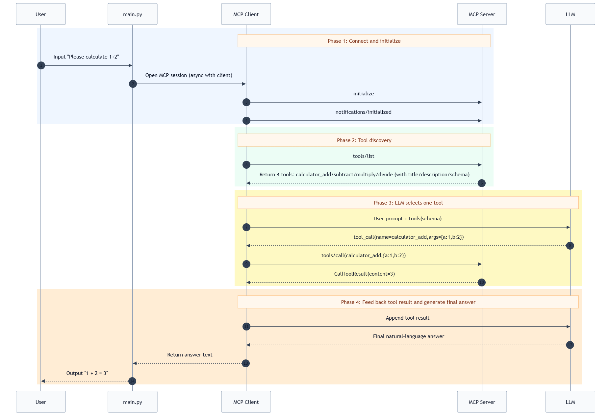

# MCP Complete Call Flow

This document explains one practical question:

How does a tool in this demo move from discovery to execution and finally to user-facing output?

## 1. Roles

There are 4 roles in one full request:

1. User: types a question in terminal.
2. Client app: `main.py + client/*`, handles MCP session, LLM loop, and tool dispatch.
3. MCP server: `server/*`, exposes actual tools.
4. LLM: decides whether to call a tool, which tool to call, and with what arguments.

## 2. Key code locations

1. `server/app.py`: registers MCP tools (`calculator_add`, `calculator_subtract`, `calculator_multiply`, `calculator_divide`).
2. `server/runtime.py`: starts FastMCP with selected transport.
3. `client/runtime.py`: creates MCP client by transport.
4. `client/llm.py`: tool discovery + tool-calling loop with LLM.
5. `main.py`: interactive entry point.

## 3. Sequence overview

- Mermaid source: [mcp_call_sequence.mmd](./mcp_call_sequence.mmd)



## 4. Step-by-step

### Step A: Register tools on server

In `server/app.py`, tools are registered via `@mcp.tool(...)`.

Example:

- `name="calculator_add"`
- `title="Calculator Add"`
- `description="Add two numbers"`

### Step B: Open MCP session and initialize

When `main.py` enters `async with mcp_client as client`, client performs handshake:

1. `initialize` request
2. `notifications/initialized` notification

After this, the protocol session is ready.

### Step C: Discover tools

`client/llm.py` calls:

- `await mcp_client.list_tools()`

Protocol operation:

- `tools/list`

The response includes at least:

1. tool `name`
2. tool `title` (if set)
3. tool `description` (if set)
4. `inputSchema` and often `outputSchema`

### Step D: Ask LLM to decide

Client sends:

1. user message
2. available tool schemas

LLM then either:

1. answers directly
2. returns `tool_calls`

### Step E: Execute selected tool via MCP

If LLM returns `tool_calls`, client executes:

- `await mcp_client.call_tool(call.function.name, arguments)`

Protocol operation:

- `tools/call`

### Step F: Feed tool result back to LLM

Client appends a `tool` message to conversation and requests one more completion.

### Step G: Print final answer

`main.py` prints the final natural-language result.

## 5. MCP operations observed in order

1. `initialize`
2. `notifications/initialized`
3. `tools/list`
4. `tools/call`

## 6. Real captured payloads (stdio transport)

Captured from real local run (not hand-written examples).

- Date: 2026-03-29
- FastMCP: `3.1.1`
- Server: `Test Server`

### 6.1 initialize (request + response)

```json
{
  "jsonrpc": "2.0",
  "id": 0,
  "method": "initialize",
  "params": {
    "protocolVersion": "2025-11-25",
    "capabilities": {},
    "clientInfo": {
      "name": "mcp",
      "version": "0.1.0"
    }
  }
}
```

```json
{
  "jsonrpc": "2.0",
  "id": 0,
  "result": {
    "protocolVersion": "2025-11-25",
    "capabilities": {
      "experimental": {},
      "prompts": {
        "listChanged": false
      },
      "resources": {
        "subscribe": false,
        "listChanged": false
      },
      "tools": {
        "listChanged": true
      },
      "extensions": {
        "io.modelcontextprotocol/ui": {}
      }
    },
    "serverInfo": {
      "name": "Test Server",
      "version": "3.1.1"
    }
  }
}
```

### 6.2 notifications/initialized

```json
{
  "jsonrpc": "2.0",
  "method": "notifications/initialized"
}
```

### 6.3 tools/list (request + response)

```json
{
  "jsonrpc": "2.0",
  "id": 1,
  "method": "tools/list"
}
```

```json
{
  "jsonrpc": "2.0",
  "id": 1,
  "result": {
    "tools": [
      {
        "name": "calculator_add",
        "title": "Calculator Add",
        "description": "Add two numbers",
        "inputSchema": {
          "additionalProperties": false,
          "properties": {
            "a": {
              "type": "integer"
            },
            "b": {
              "type": "integer"
            }
          },
          "required": [
            "a",
            "b"
          ],
          "type": "object"
        },
        "outputSchema": {
          "properties": {
            "result": {
              "type": "integer"
            }
          },
          "required": [
            "result"
          ],
          "type": "object",
          "x-fastmcp-wrap-result": true
        },
        "_meta": {
          "fastmcp": {
            "tags": []
          }
        }
      },
      {
        "name": "calculator_subtract",
        "title": "Calculator Subtract",
        "description": "Subtract second number from first number",
        "inputSchema": {
          "additionalProperties": false,
          "properties": {
            "a": {
              "type": "integer"
            },
            "b": {
              "type": "integer"
            }
          },
          "required": [
            "a",
            "b"
          ],
          "type": "object"
        },
        "outputSchema": {
          "properties": {
            "result": {
              "type": "integer"
            }
          },
          "required": [
            "result"
          ],
          "type": "object",
          "x-fastmcp-wrap-result": true
        },
        "_meta": {
          "fastmcp": {
            "tags": []
          }
        }
      },
      {
        "name": "calculator_multiply",
        "title": "Calculator Multiply",
        "description": "Multiply two numbers",
        "inputSchema": {
          "additionalProperties": false,
          "properties": {
            "a": {
              "type": "integer"
            },
            "b": {
              "type": "integer"
            }
          },
          "required": [
            "a",
            "b"
          ],
          "type": "object"
        },
        "outputSchema": {
          "properties": {
            "result": {
              "type": "integer"
            }
          },
          "required": [
            "result"
          ],
          "type": "object",
          "x-fastmcp-wrap-result": true
        },
        "_meta": {
          "fastmcp": {
            "tags": []
          }
        }
      },
      {
        "name": "calculator_divide",
        "title": "Calculator Divide",
        "description": "Divide first number by second number (b must not be zero)",
        "inputSchema": {
          "additionalProperties": false,
          "properties": {
            "a": {
              "type": "integer"
            },
            "b": {
              "type": "integer"
            }
          },
          "required": [
            "a",
            "b"
          ],
          "type": "object"
        },
        "outputSchema": {
          "properties": {
            "result": {
              "type": "number"
            }
          },
          "required": [
            "result"
          ],
          "type": "object",
          "x-fastmcp-wrap-result": true
        },
        "_meta": {
          "fastmcp": {
            "tags": []
          }
        }
      }
    ]
  }
}
```

### 6.4 tools/call (request + response)

```json
{
  "jsonrpc": "2.0",
  "id": 2,
  "method": "tools/call",
  "params": {
    "name": "calculator_add",
    "arguments": {
      "a": 1,
      "b": 2
    }
  }
}
```

```json
{
  "jsonrpc": "2.0",
  "id": 2,
  "result": {
    "content": [
      {
        "type": "text",
        "text": "3"
      }
    ],
    "structuredContent": {
      "result": 3
    },
    "isError": false
  }
}
```

## 7. What changes across transports?

The core MCP flow does not change.  
Only connection method changes:

1. `stdio`
2. `sse`
3. `streamable_http`

## 8. Common misunderstandings

1. MCP does not automatically decide tool selection.  
The LLM usually decides; MCP standardizes communication and execution.

2. `@mcp.tool` registration alone does not guarantee invocation.  
Tools must be discovered (`tools/list`) and selected by LLM (`tool_calls`).

3. Changing transport usually does not require business logic rewrite.  
Most changes are in startup and connection settings.
